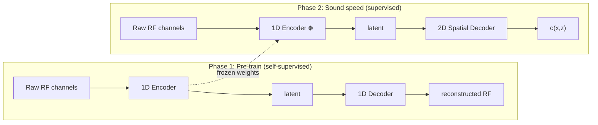

# NV-Raw2Insights-US

Learn downstream insights directly from raw sensor data. This first model estimates **tissue sound speed** from full-bandwidth ultrasound RF channel data -- a key parameter for [autofocused beamforming](https://github.com/waltsims/dbua). Sound speed supervision is generated with differentiable beamforming (DBUA) and ships with the dataset.

## Approach

A 1D convolutional autoencoder is pre-trained on RF channel reconstruction (self-supervised). The frozen encoder then serves as a feature extractor for downstream tasks -- here, a spatial decoder maps the learned representation to a sound speed map.



## Quick Start

```bash
git clone https://github.com/NVIDIA-Medtech/NV-Raw2insights-US.git && cd NV-Raw2insights-US
uv sync
uv run python prepare.py              # download dataset (one-time)
uv run python train_phase1.py         # self-supervised RF reconstruction
uv run python train_phase2.py         # supervised sound speed (encoder frozen)
```

## Dataset & Pre-trained Weights

Hosted on HuggingFace as [`nvidia/NV-Raw2Insights-US`](https://huggingface.co/nvidia/NV-Raw2Insights-US). Pre-trained checkpoints are also available for direct inference.

| Split | Samples | Description |
|---|---|---|
| `train` | ~90% | Training set |
| `validation` | ~10% | Held-out validation |

Use split slicing for quick testing: `--train-split "train[:10%]" --val-split "train[90%:]"`

| Column | Description |
|---|---|
| `iq_real`, `iq_imag` | Raw RF channel data (real/imaginary) |
| `sound_speed_map` | DBUA-derived sound speed supervision |
| `bmode` | Unfocused B-mode image |
| `bmode_focused` | Focused B-mode image |
| `segmentation_map` | Tissue segmentation mask |
| `phase_error` | Phase aberration error (rad) |
| `elpos` | Transducer element positions |
| `fs`, `fc`, `fd`, `t0`, `c0` | Acquisition parameters |

## Structure

```text
prepare.py             # Download dataset from HuggingFace (run once)
train_phase1.py        # RF autoencoder pre-training
train_phase2.py        # Sound speed decoder (loads phase1.ckpt)
inference.py           # Predict sound speed (Holoscan live display)
models/
  autoencoder.py       # IQAutoencoder (1D conv)
  sound_speed.py       # SoundSpeedDecoder (projector + U-Net)
utils/
  metrics.py           # SNR, complex correlation
  training.py          # Checkpointing, DDP, LR schedule
```

## License

- **Code**: [Apache 2.0](LICENSE)
- **Model weights**: [CC BY-NC 4.0](https://creativecommons.org/licenses/by-nc/4.0/)
- **Dataset**: [CC BY 4.0](https://creativecommons.org/licenses/by/4.0/)
