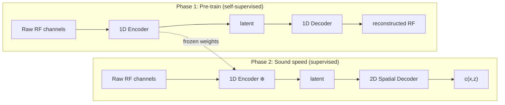

# NV-Raw2Insights-US

[](LICENSE)
[](LICENSE.weights)
[](https://huggingface.co/nvidia/NV-Raw2Insights-US)
[](https://python.org)

Estimates tissue speed-of-sound from raw ultrasound RF channel data, enabling adaptive beamforming for sharper images — trained with [DBUA](https://github.com/waltsims/dbua) differentiable beamforming supervision.

<p align="center">
  
</p>

## Overview

Standard ultrasound imaging assumes sound travels at the same speed everywhere in the body. In practice, different tissues propagate sound at different speeds, causing image blur. This model estimates a spatially-varying speed-of-sound (SoS) map from raw sensor data, enabling the beamformer to correct for local tissue properties and produce sharper images — analogous to autofocus on a camera, but for ultrasound.

NV-Raw2Insights-US estimates 2D SoS maps from raw ultrasound in-phase/quadrature (IQ) channel data — the complex-valued signals captured by each transducer element before any image is formed. A 1D CNN encoder maps multi-static IQ acquisitions to a latent representation; a 2D CNN head decodes it to a 32 x 32 SoS map. Ground-truth SoS fields for training are computed by the [DBUA](https://github.com/waltsims/dbua) differentiable beamforming solver.

> **Research and development only.** Not validated for clinical use.



## News

- **[March 2026]** — Released NV-Raw2Insights-US with pre-trained checkpoints and simulated [dataset](https://huggingface.co/nvidia/NV-Raw2Insights-US)

## Model Variants

| Model | Parameters | HuggingFace | License |
|-------|:----------:|-------------|---------|
| [NV-Raw2Insights-US](https://huggingface.co/nvidia/NV-Raw2Insights-US) | 2.3M | [Download](https://huggingface.co/nvidia/NV-Raw2Insights-US) | [CC BY-NC 4.0](LICENSE.weights) |

## Quick Start

Requires Python 3.10+ and an NVIDIA GPU with >= 12 GB VRAM.

### Installation

```bash
git clone https://github.com/NVIDIA-Medtech/NV-Raw2insights-US.git && cd NV-Raw2insights-US
uv sync
```

### Inference

Run sound speed prediction on HuggingFace validation data (auto-downloads pre-trained weights):

```bash
uv run python inference.py
```

### Training

Training data is hosted on [HuggingFace](https://huggingface.co/nvidia/NV-Raw2Insights-US) (simulated ultrasound generated with [k-Wave](https://github.com/ucl-bug/k-wave), licensed [CC BY 4.0](https://creativecommons.org/licenses/by/4.0/)).

```bash
uv run python prepare.py              # download dataset (one-time)
uv run python train_phase1.py         # self-supervised RF reconstruction
uv run python train_phase2.py         # supervised sound speed (encoder frozen)
```

Use split slicing for quick testing: `--train-split "train[:10%]" --val-split "train[90%:]"`

## Performance

| | RTX PRO 6000 Blackwell | NVIDIA Thor (iGPU) |
|---|---|---|
| **End-to-end** | 75.5 ms | 332.1 ms |
| **Throughput** | 13.2 fps | 3.0 fps |
| **Peak GPU memory** | 9.2 GB | 13.4 GB |

## License

| Component | License |
|-----------|---------|
| Source code | [Apache 2.0](LICENSE) |
| Model weights | [CC BY-NC 4.0](LICENSE.weights) |

## Resources

- [HuggingFace](https://huggingface.co/nvidia/NV-Raw2Insights-US) — Model weights, checkpoints, and dataset
- [NV-Raw2Insights-MRI](https://huggingface.co/nvidia/NV-Raw2Insights-MRI) — Sibling model for MRI reconstruction
- [DBUA](https://github.com/waltsims/dbua) — Differentiable beamforming for ultrasound autofocusing (Simson et al., MICCAI 2023)
- [k-Wave](https://github.com/ucl-bug/k-wave) — Acoustic simulation toolkit (training data generation)
